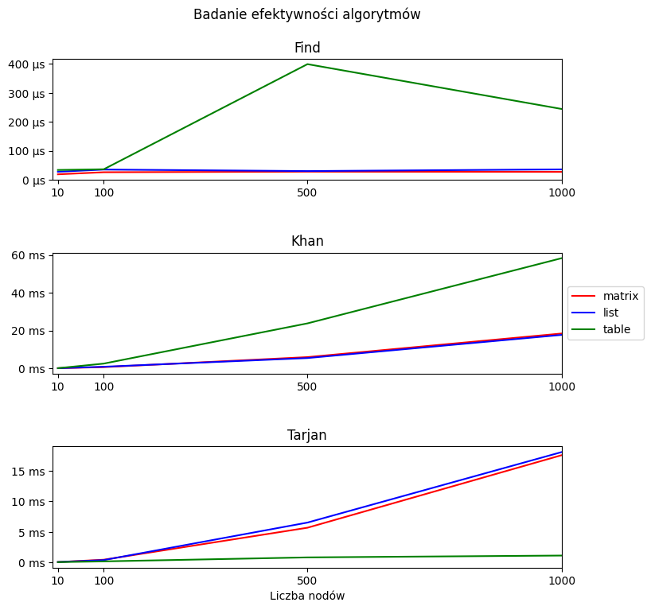

# Sortowanie topologiczne - grafy

# Wstęp

Grafy stanowią niezwykle użyteczny narzędzie zarówno w informatyce, jak
i w innych dziedzinach nauki, od analizy sieci społecznych po
modelowanie struktur danych w informatyce. Celem niniejszego
sprawozdania jest przestawienie procesu implementacji grafu w języku C++
oraz szczegółowa analiza algorytmów operujących na grafach.<br>
W ramach tej pracy dokonano dogłębnej analizy różnych struktur danych,
które zapewniają efektywną implementację grafu. Ponadto, przedstawione
zostaną wyniki testów wydajnościowych, które pozwolą na ocenę
efektywności opracowanej implementacji. Dodatkowo, omówione zostaną
potencjalne zastosowania grafu oraz wnioski z przeprowadzonych analiz,
które wskazują na obszary dalszych prac i możliwości optymalizacji.<br>
Testy benchmark zostały wykonane na komputerze Apple Macbook Air z
procesorem M2.<br>


**Projekt dostępny jest w całości na platofrmie
[Github](https://github.com/Skamlo/AiSD-BST).**

# Tworzenie grafu

Graf można utworzyć na dwa sposoby. Dostępne jest ręczne wpisanie grafu
oraz generowanie grafu. Podczas operacji generowania musimy podać liczbę
wierzchołków oraz saturację.<br>
Zaimplementowane zostały trzy reprezentacje maszynowe grafu - macierz
sąsiedztwa, lista następników, lista krawędzi. Dla każdej reprezentacji,
poszczególne algorytmy różnią się wydajnością i formą.

### Matrix
```
nodes> 5
saturation>100

action> type
type> matrix

action> print
  | 1 2 3 4 5
--+-----------
1 | 0 0 1 1 1
2 | 0 0 1 1 1
3 | 0 0 0 1 1
4 | 0 0 0 0 1
5 | 0 0 0 0 0
```

### List
```
nodes> 5
saturation>100

action> type
type> list

action> print
1> 3 4 5
2> 3 4 5
3> 4 5
4> 5
5>
```

### Table
```
nodes> 5
saturation>100

action> type
type> table

action> print
    [1, 3]
    [1, 4]
    [1, 5]
    [3, 3]
    [1, 4]
    [2, 5]
    [3, 4]
    [3, 5]
    [4, 5]
```

# Badanie efektywności algorytmów

Pomiar czasów wykonany za pomocą bilbioteki std::chrono. Poniżej
znajduje się przykładowa implementacja:

``` c
    std::ofstream outputFile{"filename", std::ios_base::app};
    const auto start{std::chrono::high_resolution_clock::now()};
    // ALGORITHM HERE
    const auto end{std::chrono::high_resolution_clock::now()};
    auto measureTime = std::chrono::duration_cast<std::chrono::microseconds>(end - start);
    // WRITE TO FILE
    outputFile.flush();
    outputFile.close();
```

Poniżej znajdują się wykresy wizualizujące efektywność poszczególnych
algorytmów. Pomiary zostały wykonane dla czterech instancji (liczby
nodów): $10, 100, 500, 1000$. Mierzone są stricte funkcje, bez
generowania grafu. Przedstawione pomiary w ogólności zgadzają się z
założeniami teoretycznymi. Mogły jednak wystąpić pewne odchylenia, co
widoczne jest przy znajdowaniu krawędzi przy reprezentacji listy
krawędzi.

<br>
<p align="center">
    
</p>
<br><br>

Zbadane zostały trzy operacje:

-   **Find** - znajdowanie danej krawędzi w grafie. Złożoność
    znajdowania krawędzi w grafie różni się w zależności od
    reprezentacji maszynowej grafu. Dla macierzy sąsiedztwa wynosi
    $O(1)$, listy następników $O(n)$, listy krawędzi $O(m)$.

-   **Kahn** - Algorytm Kahna rozpoczyna swoje działanie od
    identyfikacji wszystkich wierzchołków w grafie o zerowym stopniu
    wejściowym. Te wierzchołki są następnie umieszczane w kolejce
    wierzchołków do przetworzenia. Kolejnym krokiem jest pobieranie
    wierzchołków z tej kolejki. Przetworzenie każdego wierzchołka polega
    na dodaniu go do listy wierzchołków w porządku topologicznym oraz
    usunięciu wszystkich krawędzi wychodzących z tego wierzchołka. Jeśli
    po usunięciu krawędzi wierzchołek, do którego one prowadziły, ma
    zerowy stopień wejściowy, jest on dodawany do kolejki wierzchołków
    do przetworzenia.

-   **Tarjan** - Algorytm Tarjana opiera się na przeszukiwaniu grafu w
    głąb (DFS). Po obliczeniu czasu wyjścia dla każdego wierzchołka,
    jest on wstawiany na początek listy posortowanych wierzchołków. Po
    zakończeniu działania algorytmu DFS lista ta zawiera wierzchołki
    ułożone w porządku topologicznym.

# Podsumowanie

Przeprowadzenie projektu związanego z implementacją oraz analizą grafów
dostarczyło cennych wniosków dotyczących efektywności obu tych struktur
danych. Poznanie różnic w implementacji i działaniu różnych
reprezentacji maszynowych grafu było kluczowym aspektem tego badania.
Analiza wyników pomiarów pozwoliła nam na lepsze zrozumienie
charakterystyki tej struktury danych oraz możliwych jej zastosowań.
